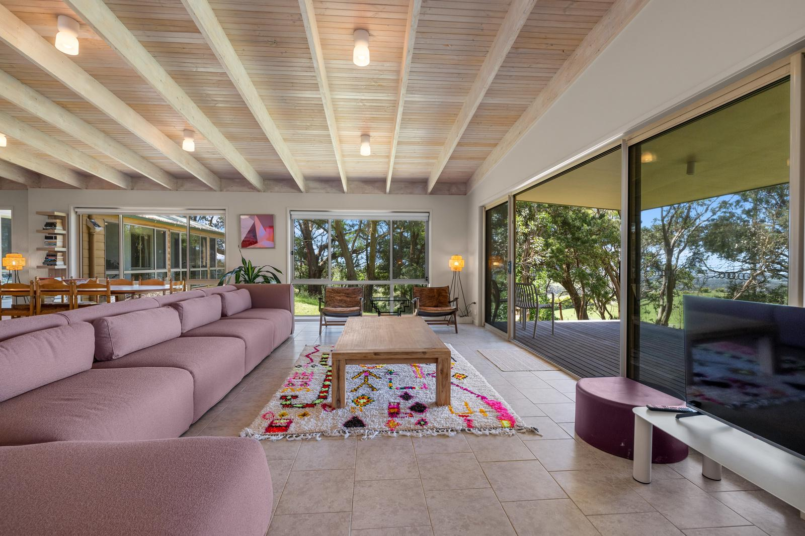

# Pat's House @ The Prom

A beautiful, responsive landing page for **Pat's House @ The Prom** — a character-filled country retreat with sweeping views of Wilsons Promontory, set on three acres of pristine bushland in Fish Creek, Victoria, Australia.

**[View Live Site](https://marlon0807.github.io/pats_house/)** | **[Book on Airbnb](https://www.airbnb.com/rooms/1526428451037156787)**



## About the Property

Pat's House is a spacious vacation rental perfect for family gatherings and group retreats. Located approximately 2-3 hours from Melbourne, it offers:

- **5 bedrooms** sleeping up to **12 guests** (plus sofa beds for additional children on request)
- **3 bathrooms** with walk-in showers
- **2 living areas** each with a wood-burning fireplace
- **Modern kitchen** with island bench and 10-seater dining table
- **Outdoor entertaining** with pizza oven, Weber BBQ, and covered verandah
- **3 acres of bushland** with native wildlife — kangaroos, wombats, echidnas, and birdlife
- **High-speed Starlink internet**, Smart TVs, and self check-in
- **Yoga & Zen space** for meditation and peaceful reflection

### Location Highlights

| Attraction | Distance |
|---|---|
| Wilsons Promontory National Park | 10-15 min |
| Sandy Point Beach | 10 min |
| Waratah Bay | 12 min |
| Fish Creek Township (galleries, cafes) | 15 min |
| Foster Township | 10 min |
| Gurney's Cidery | 15 min |
| Waratah Hills Vineyard | 20 min |
| Agnes Falls | 25 min |
| Great Southern Rail Trail | Nearby access |

## Tech Stack

This is a lightweight, static website with no build tools or dependencies:

- **HTML5** — semantic, single-page layout
- **CSS3** — custom properties, CSS Grid, fluid typography with `clamp()`, scroll animations
- **Vanilla JavaScript** — Intersection Observer API for scroll animations, smooth scrolling
- **Google Fonts** — Cormorant Garamond (headings) and Montserrat (body)

## Project Structure

```
pats_house/
├── index.html              # Single-page site (all content)
├── assets/
│   ├── css/
│   │   └── style.css       # All styling, responsive design, animations
│   ├── js/
│   │   └── main.js         # Scroll animations & smooth scrolling
│   └── images/             # High-resolution property photos
├── .nojekyll               # Disables Jekyll processing for GitHub Pages
├── CLAUDE.md               # AI assistant guidance
└── README.md
```

## Local Development

No build step required. Simply serve the files with any HTTP server:

```bash
# Python
python3 -m http.server 8000

# Node.js (npx)
npx serve .

# PHP
php -S localhost:8000
```

Then open [http://localhost:8000](http://localhost:8000) in your browser.

## Deployment

The site is deployed via **GitHub Pages** from the `main` branch. Any push to `main` automatically updates the live site.

## Design

### Color Palette

| Color | Hex | Usage |
|---|---|---|
| Forest Green | `#2C5F3D` | Primary brand color, headings |
| Light Green | `#4A8259` | Gradients, accents |
| Warm Tan | `#D4A574` | CTA buttons, decorative accents |
| Cream | `#F8F4EF` | Page background |
| Charcoal | `#2B2B2B` | Body text, footer |
| Earth Brown | `#8B7355` | Secondary text |

### Page Sections

1. **Hero** — Full-viewport background image with overlay, title, and Airbnb booking CTA
2. **Gallery** — Aerial photo + responsive grid of property images with hover overlays
3. **Features** — Six feature cards highlighting key selling points
4. **Accommodation** — Detailed breakdown of sleeping, bathrooms, kitchen, and entertainment
5. **Fireplace** — Showcase of both wood-burning fireplaces
6. **Location** — Nearby attractions with distances
7. **Testimonials** — 5-star guest reviews
8. **CTA** — Final booking call-to-action
9. **Footer** — Host info and quick links

### Responsive Breakpoints

- **Desktop**: 3-column grids for features and location highlights
- **Tablet** (968px): Fireplace section stacks to single column
- **Mobile** (768px): All grids collapse to single column

## License

All rights reserved. Property images and content are owned by the property host.
